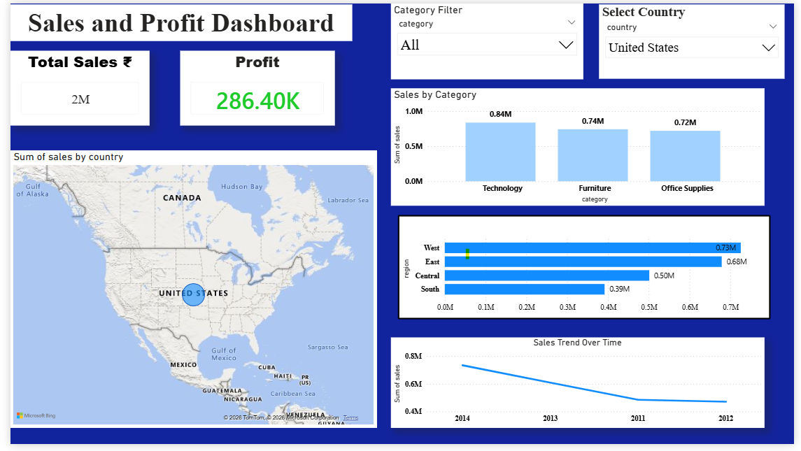

## 🌍 Geographical Sales Analysis Dashboard (Power BI)

### 📌 Business Objective  
To analyze global sales performance and identify top-performing regions, categories, and trends for better decision-making.

---

### 📊 Dashboard Overview  
This project is an interactive Power BI dashboard that visualizes sales data across countries and regions using map-based insights and key performance indicators.

---

### 🔍 Key Metrics  
- Total Sales: 4K+  
- Profit: 709+  

---

### 📈 Key Insights  
- EMEA region generates the highest sales (~3.9K)  
- Technology category contributes the most revenue (~2.4K)  
- Sales show a declining trend over time  

---

### ⚙️ Features  
- Interactive slicers for category and country filtering  
- Map visualization for geographical analysis  
- Category-wise and region-wise performance breakdown  
- Sales trend over time  

---

### 🛠 Tools & Technologies  
- Power BI  
- Power Query  
- Microsoft Excel  

---

### 📸 Dashboard Preview  

---

### 📁 Project Files  
- geographical-sales-dashboard.pbix  
- SuperStoreOrders_clean.xlsx  
- dashboard-preview.png  

---

### 👩‍💻 Author  
Urvi Khandelwal  
